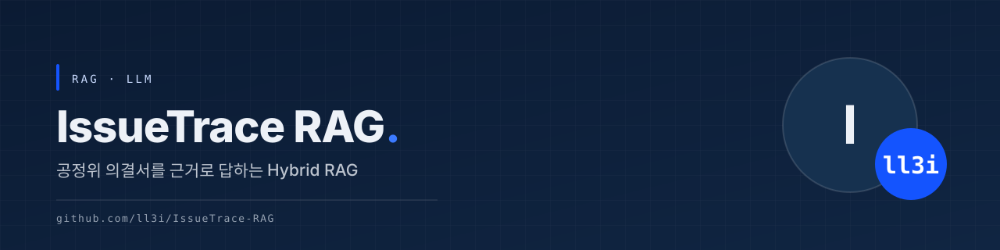
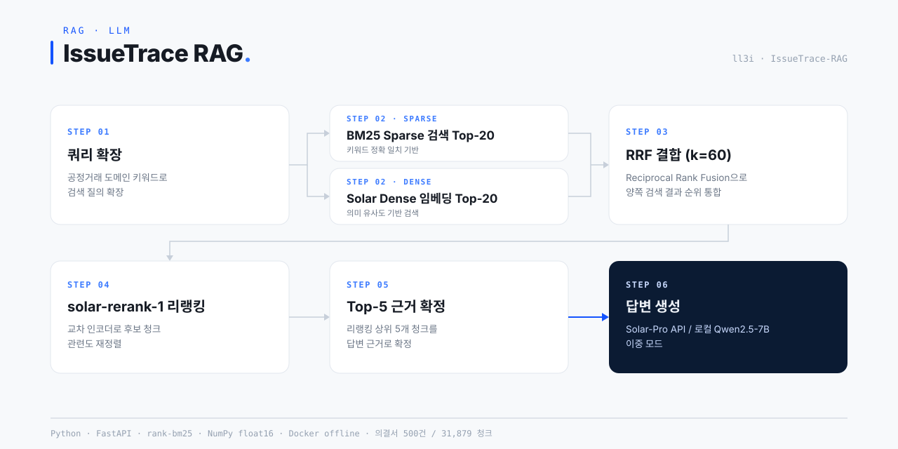
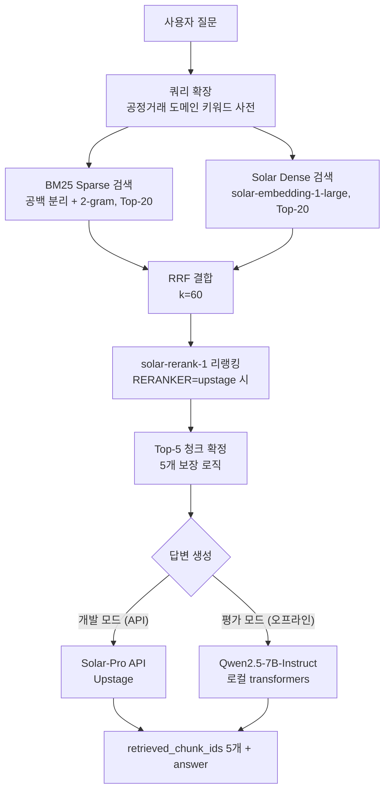

# IssueTrace RAG

**공정거래위원회 의결서 쟁점 추출 기반 Hybrid RAG 질의응답 시스템**

제2회 공정위 AI·데이터 활용 공모전 **Track 2 (AI 모델 개발)** 출품작입니다.
공정거래위원회 의결서 500건(31,879개 청크)을 대상으로, 사용자의 질의에 대해 근거 청크 5개를 탐색하고 검색된 근거만을 바탕으로 신뢰도 높은 답변을 생성합니다.


---

## 한눈에 보기



## 주요 특징

- **Hybrid Retrieval** — BM25(Sparse)와 Solar Dense 임베딩 검색을 병행하여 법률 용어의 키워드 정밀성과 의미 유사성을 동시에 확보합니다.
- **RRF(Reciprocal Rank Fusion)** — 두 검색 결과를 `score = Σ 1/(k + rank)` (k=60)로 통합해 Top-5 청크 품질을 극대화합니다.
- **solar-rerank-1 리랭킹** — Upstage Rerank API 기반 재정렬을 지원합니다 (`RERANKER=upstage`, 기본값 `none`).
- **근거 중심 답변 생성** — 검색된 의결서 청크만을 컨텍스트로 사용해 할루시네이션을 방지합니다.
- **API / 로컬 LLM 이중 모드** — 개발 환경에서는 Solar-Pro API, 인터넷이 차단된 평가 환경에서는 로컬 Qwen2.5-7B-Instruct로 완전 오프라인 동작합니다.
- **한국어 특화 BM25 토크나이저** — konlpy 등 형태소 분석기 없이 공백 분리 + 문자 2-gram으로 법률 용어 부분 매칭을 처리합니다.
- **경량 벡터 인덱스** — ChromaDB 대신 NumPy `.npy`(float16, 31,879×4096) 행렬 내적으로 코사인 유사도를 계산합니다.

## 아키텍처



### 이중 모드 구성

| 컴포넌트 | 개발 환경 (API) | 평가 환경 (`OFFLINE_MODE=true`) |
|---------|----------------|-------------------------------|
| 검색 | BM25 + Solar Dense (Hybrid) | BM25 단독 |
| 임베딩 | solar-embedding-1-large (passage/query 비대칭) | — |
| 리랭킹 | solar-rerank-1 (선택) | — |
| 생성 | Solar-Pro API | Qwen2.5-7B-Instruct (로컬, float16) |

평가 환경은 인터넷이 완전 차단되므로, 서버 시작 시 `lifespan`에서 로컬 LLM을 사전 로드해 첫 요청 30초 제한을 준수합니다.

## 설치 및 실행

### 1. 개발 모드 (Solar API)

```bash
cd rag_system

# Python 3.11 권장
pip install -r requirements.txt

# .env 설정 (rag_system/.env.example 참고)
# UPSTAGE_API_KEY=<발급받은 키>
# EMBEDDING_PROVIDER=upstage
# GENERATION_MODEL=solar-pro
# RERANKER=none
# DATA_DIR=<AI활용데이터 경로>
# INDEX_DIR=<index 디렉토리 경로>

# 인덱스 빌드 (최초 1회)
python build_index.py        # BM25 인덱스 + corpus.json
python build_numpy_index.py  # Dense 임베딩 (.npy, 체크포인트 재개 지원)

# 서버 실행
python server.py
# → http://localhost:8001 대시보드 접속

# CLI 테스트
python pipeline.py "BGF리테일의 판매촉진비용 위반 행위는 무엇인가요?"
```

### 2. Docker 오프라인 모드 (평가 제출용)

```bash
cd rag_system

# 로컬 LLM 사전 다운로드 (인터넷 가능한 환경에서 1회)
python download_models.py    # models/Qwen2.5-7B-Instruct (~15GB)

# 이미지 빌드
docker build -t rag-submission:latest .

# 실행 및 테스트
docker run --gpus all -p 8000:8000 rag-submission:latest
curl http://localhost:8000/health
curl -X POST http://localhost:8000/predict \
  -H "Content-Type: application/json" \
  -d '{"id": "eval_0001", "question": "BGF리테일 판매촉진비용 위반"}'

# 제출용 tar 생성
docker save rag-submission:latest -o submission.tar
```

### API 엔드포인트

| 엔드포인트 | 용도 |
|-----------|------|
| `POST /predict` | 평가 서버용 — `retrieved_chunk_ids`(정확히 5개) + `answer` 반환 |
| `POST /query` | 대시보드용 — 청크 본문·메타데이터 포함 확장 응답 |
| `GET /health` | 헬스체크 |
| `GET /stats` | 코퍼스·설정 통계 |
| `GET /` | 대시보드 UI |

## 프로젝트 구조

```
IssueTrace-RAG/
├── README.md
├── 대회 소개.md               # 공모전 Track 2 개요·평가 기준
├── rag_system/                # 메인 소스코드
│   ├── server.py              #   FastAPI 서버 (진입점)
│   ├── pipeline.py            #   RAG 파이프라인 통합 (쿼리 확장 → 검색 → 리랭킹 → 생성)
│   ├── config.py              #   환경변수·설정 관리
│   ├── corpus.py              #   의결서 청크 데이터 로드
│   ├── bm25_retriever.py      #   BM25 Sparse 검색 (2-gram 토크나이저)
│   ├── dense_retriever.py     #   Solar 임베딩 Dense 검색 (NumPy)
│   ├── hybrid_retriever.py    #   BM25 + Dense RRF 결합
│   ├── reranker.py            #   solar-rerank-1 / LLM 리랭커
│   ├── generator.py           #   답변 생성 (API·로컬 분기)
│   ├── generator_local.py     #   로컬 Qwen2.5-7B 생성
│   ├── build_index.py         #   BM25 인덱스 빌드
│   ├── build_numpy_index.py   #   Dense 임베딩 인덱스 빌드
│   ├── download_models.py     #   로컬 모델 사전 다운로드
│   ├── Dockerfile             #   제출용 오프라인 이미지
│   ├── entrypoint.sh          #   컨테이너 환경변수 고정
│   ├── requirements.txt
│   ├── static/index.html      #   대시보드 UI
│   └── index/                 #   빌드된 인덱스 (대용량 파일은 git 제외)
└── AI활용데이터/               # 대회 제공 데이터셋 (git 제외)
```

## 평가 지표 최적화 전략

- **Recall@5 & MRR** — Hybrid Retrieval + RRF(+리랭킹) 파이프라인으로 정답 청크가 최상위에 노출되도록 튜닝했습니다.
- **BERTScore & F1** — API/로컬 LLM별 근거 요약 템플릿으로 정답 문장과의 의미·토큰 일치율을 안정적으로 확보합니다.
- **감점 방지** — 청크 5개 보장·중복 제거·코퍼스 존재 검증 및 모델 사전 로드로 30초 응답 제한을 준수합니다.

## 상세 문서

아키텍처 세부 설계, 인덱스 구축 과정, 트러블슈팅(ChromaDB→NumPy 전환, 비대칭 임베딩, 오프라인 대응 등)은 [`rag_system/README.md`](rag_system/README.md)를 참고하세요.
