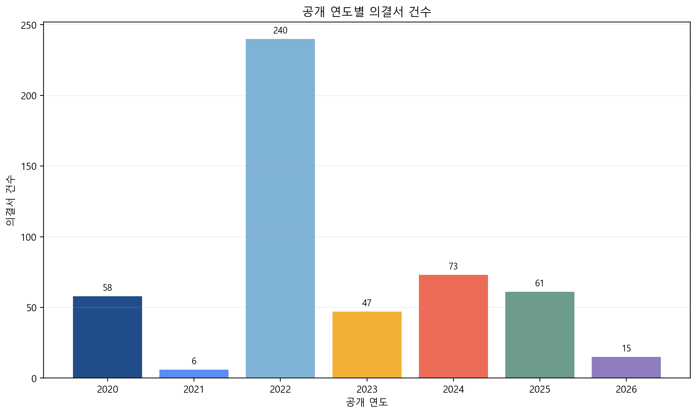
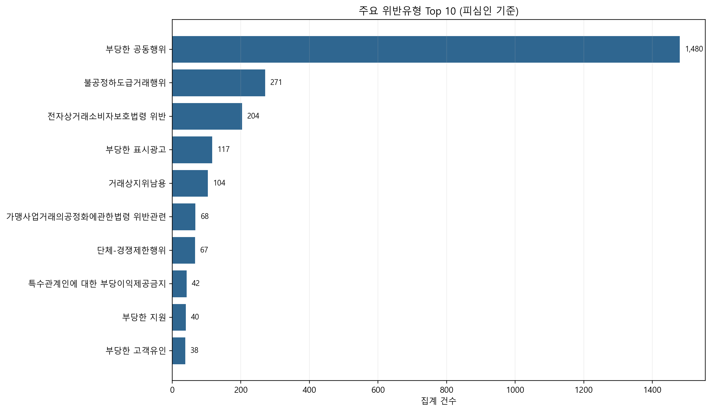
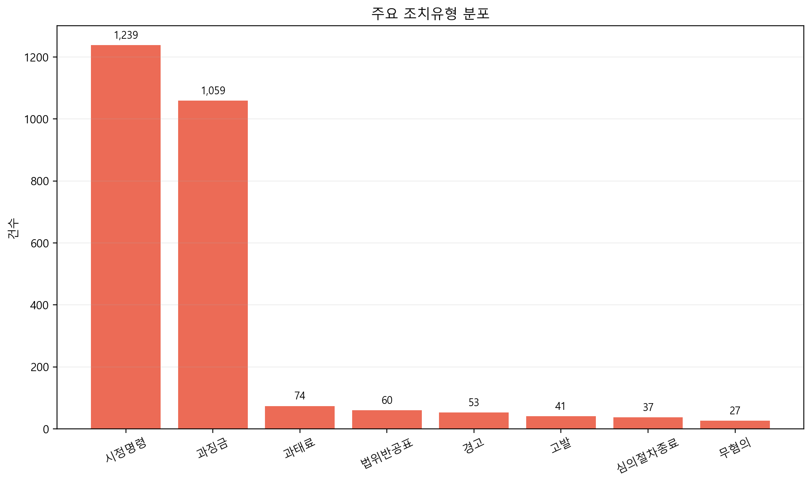
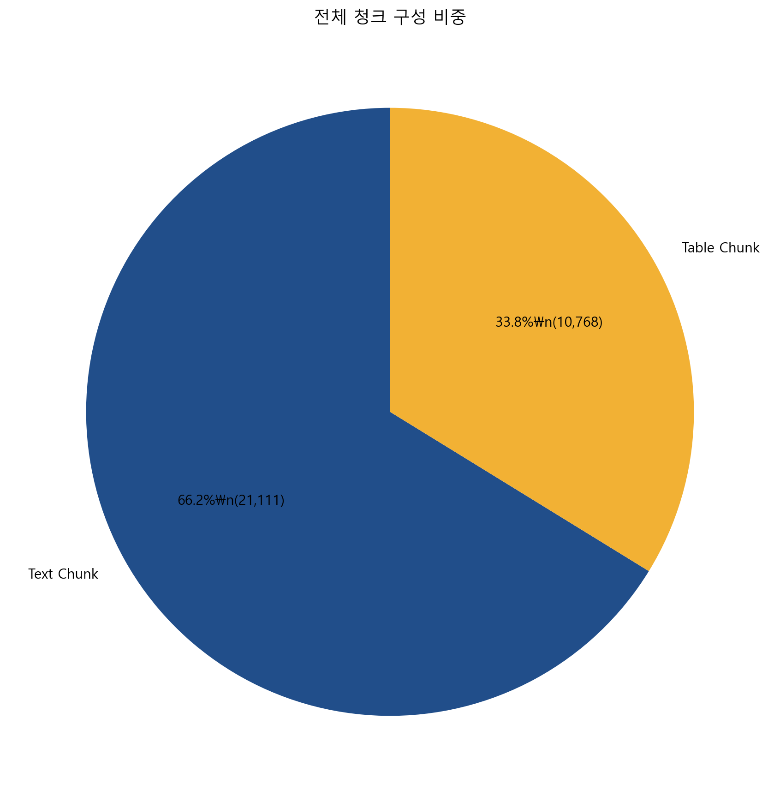
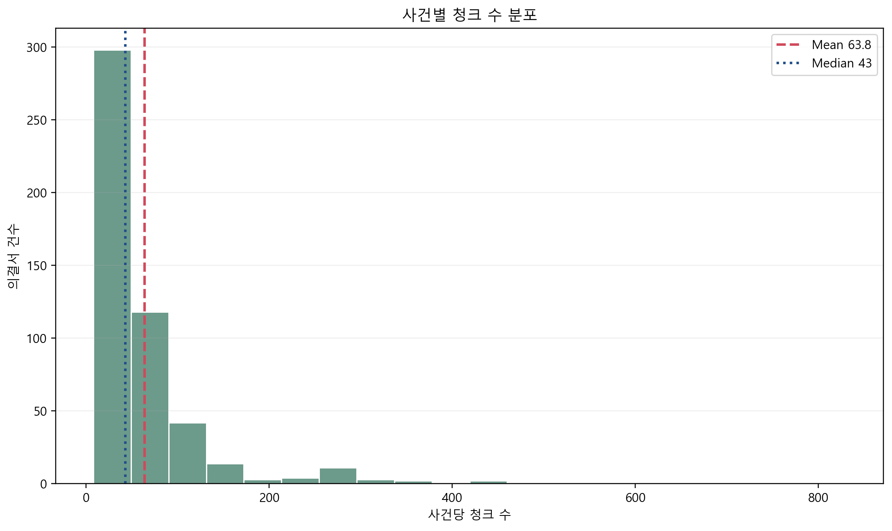
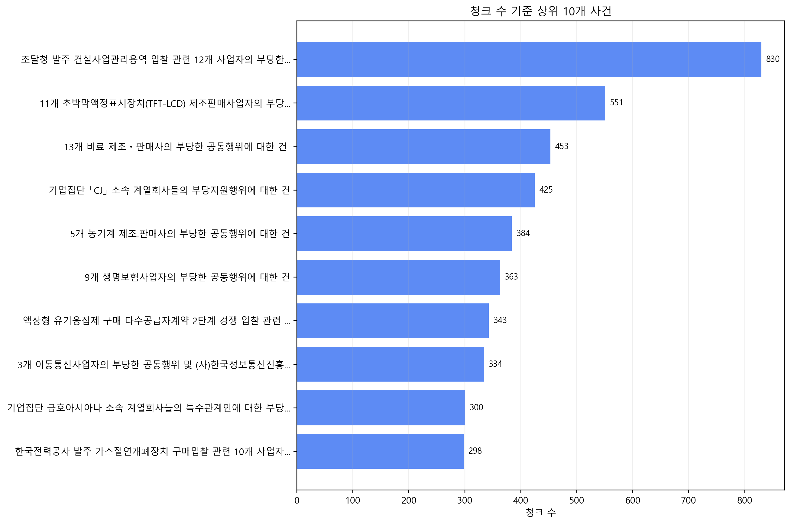

# IssueTrace RAG 기획서

공정거래 의결서 하이브리드 검색·생성 시스템  
제출 트랙: Track 2 (AI 모델 개발)  
작성일: 2026년 4월

---

## Ⅰ. 기획서 개요

### 1.1 아이디어 기획 분야 및 목적

본 아이디어는 공공 법률 데이터의 실질 활용을 목표로 하는 데이터·기술 혁신형 AI 서비스이자, 일반 국민과 소상공인, 기업 실무자가 모두 체감할 수 있는 국민 체감형 서비스에 해당한다. 공정거래위원회가 공개하는 의결서는 공공성이 높고 사회적 파급력이 큰 데이터이지만, 현재는 PDF 또는 HTML 문서 단위로 흩어져 있어 검색성과 활용성이 충분히 확보되지 못하고 있다. 본 기획은 이 공개 데이터를 검색 가능한 지식 자산으로 전환하고, 사용자가 자연어 질문만으로 관련 근거와 설명을 함께 확보할 수 있도록 하는 데 초점을 둔다.

IssueTrace RAG의 핵심 목적은 공정거래 의결서라는 고난도 법률 문서를 비전문가도 활용 가능한 형태로 재구성하는 것이다. 사용자는 더 이상 특정 법률 용어나 사건명을 미리 알고 있어야만 정보를 찾을 수 있는 구조에 머무르지 않고, 자신의 상황을 평이한 문장으로 입력해도 관련 의결서 조각과 함께 해석 가능한 답변을 받을 수 있다. 이는 단순한 검색 기능 추가가 아니라, 공개 행정 데이터의 접근 방식을 "문서 열람"에서 "질문 중심 탐색"으로 바꾸는 시도라고 볼 수 있다.

또한 본 서비스는 단지 국민 편의성 향상에만 머무르지 않는다. 기업 법무팀과 컴플라이언스 담당자에게는 사전 리스크 점검 도구가 되고, 공정위 조사관이나 연구자에게는 유사 선례 탐색 효율을 높이는 실무형 검색 시스템이 된다. 결국 하나의 데이터셋을 다층적 수요에 맞게 재가공함으로써 공공 데이터의 재사용 가치, 행정 효율성, 법률 접근성, 시장 내 준법 문화를 동시에 강화하는 것이 본 기획의 전략적 목적이다.

본 기획의 목적은 다음 네 가지로 요약된다.

| 목적 | 설명 |
|------|------|
| 정보 민주화 | 법률 전문가가 아니어도 공정거래 사건의 핵심 쟁점, 제재 결과, 판단 근거를 자연어로 확인할 수 있도록 한다. |
| 행정 효율화 | 조사·분석·연구 업무에서 유사 의결서 탐색 시간을 줄이고, 반복 열람 비용을 낮춘다. |
| 데이터 실활용 | 공개 의결서 500건을 31,879개 검색 단위로 재구성해 실질적인 AI 서비스 자산으로 전환한다. |
| 사전 예방 기능 | 기업과 소상공인이 유사 제재 사례를 미리 파악하여 법 위반 가능성을 조기 점검하도록 지원한다. |

본 아이디어가 가지는 차별점은 "검색 품질"과 "해석 가능성"을 동시에 추구한다는 점이다. 기존 키워드 검색은 제목이나 일부 단어 매칭 중심이라 질의 의도와 사건 맥락을 충분히 반영하지 못했다. 반면 IssueTrace RAG는 BM25 기반 정밀 검색과 Dense Embedding 기반 의미 검색을 결합하여 법률 데이터 특유의 전문성과 문장 다양성을 함께 다룬다. 그 결과, 공정거래 공개 데이터를 단순 보관형 자산이 아니라 실제 의사결정을 돕는 지능형 데이터 서비스로 전환할 수 있다.

### 1.2 제안 배경 및 필요성

공정거래위원회는 공정거래법, 하도급법, 대규모유통업법, 전자상거래법, 가맹사업법 등과 관련된 다수의 사건을 심의하고 의결서를 공개하고 있다. 이 의결서에는 위반 사실의 인정 여부, 법적 판단 구조, 관련 매출액과 제재 수준, 시정명령 또는 과징금 부과 사유 등 시장 참여자가 실제로 필요로 하는 정보가 풍부하게 담겨 있다. 그러나 현재 제공 방식은 개별 문서 열람 중심이어서, 사건 간 비교와 검색, 질의 응답형 활용이 어렵다.

특히 공정거래 의결서는 일반 뉴스 기사나 민원 안내문과 달리 법리 판단의 전개, 사실관계 정리, 표 기반 수치 정보, 피심인별 조치 내용 등 복합적인 구조를 가진다. 사용자가 단순히 "판촉비 부담을 본사와 절반 이상 나눠야 하나?" 또는 "입찰 담합이 적발되면 어떤 제재를 받는가?"와 같은 현실적인 질문을 갖고 있더라도, 그 질문을 기존 시스템에서 직접 해결하기는 어렵다. 관련 사건을 검색하려면 적절한 법률 용어를 먼저 알고 있어야 하고, 검색 결과가 나와도 수십 페이지 분량의 문서를 직접 읽어 맥락을 재구성해야 한다.

이 문제는 세 가지 층위에서 심각하다. 첫째, 일반 국민과 소상공인에게는 정보 비대칭 문제를 심화시킨다. 공정거래 사건은 생활과 사업에 직접 영향을 미치지만, 실제 판단 기준과 제재 수준에 대한 정보 접근 비용은 매우 높다. 둘째, 기업 실무 관점에서는 준법 경영을 위한 사전 점검 도구가 부족하다. 외부 자문 이전 단계에서 내부적으로 유사 제재 사례를 빠르게 확인할 수 있는 환경이 갖춰져 있지 않다. 셋째, 공공 행정 및 연구 측면에서는 이미 공개된 양질의 데이터를 제대로 탐색·재사용하지 못하는 비효율이 발생한다.

사회적 수요 역시 분명하다. 공정거래 관련 민원과 신고는 매년 지속적으로 발생하고 있으며, 가맹·하도급·유통·전자상거래 분야의 분쟁은 실생활 및 중소사업자 운영과 밀접하게 연결된다. 동시에 ESG, 준법경영, 내부통제 중요성이 커지면서 기업 법무팀은 특정 행위가 공정거래법상 어떤 리스크를 가지는지 빠르게 파악할 필요가 있다. 하지만 현재 시장에는 공정거래 의결서에 특화된 한국어 Legal AI 검색 서비스가 사실상 없는 상태다. 이 공백은 공공 데이터의 실사용 관점에서 매우 큰 기회 요인이기도 하다.

IssueTrace RAG는 바로 이 지점을 겨냥한다. 공개 의결서 전체를 검색 가능한 청크 단위로 재구성하고, 사용자의 자연어 질문을 법률 도메인에 맞게 확장·해석한 뒤, 관련 근거를 선별해 생성형 답변을 제공함으로써 기존 공개 시스템의 한계를 보완한다. 즉, 단순한 문서 저장소를 "질문 중심 의사결정 지원 시스템"으로 바꾸는 것이 본 제안의 필요성이다.

현재 구조와 제안 구조의 차이는 다음과 같이 요약된다.

| 현재 공개 방식 | 제안 서비스 적용 후 |
|------|------|
| 의결서 500건이 문서 단위로 분산 게시 | 500건 전체를 31,879개 청크로 통합 색인 |
| 제목·날짜 중심 검색 | 자연어 의미 검색 및 도메인 확장 검색 |
| 결과 목록 위주 열람 | 근거 청크와 AI 설명 답변 동시 제공 |
| 법률 전문성 요구 | 비전문가도 활용 가능한 질의형 접근 |
| 누적 데이터 활용률 제한 | 실무형 AI 서비스로 가치 재창출 |

### 1.3 아이디어 구축 결과 요약

IssueTrace RAG는 공정거래 의결서 500건을 대상으로 실제 검색 가능한 하이브리드 RAG 시스템을 구축한 결과물이다. 데이터는 사건 단위 문서를 그대로 사용하는 대신, 본문과 표 구조를 보존한 하이브리드 JSON을 기반으로 31,879개의 청크 단위로 재색인하였다. 이 과정에서 텍스트와 표를 분리하지 않고 함께 살림으로써, 법리 설명과 수치 정보가 공존하는 법률 문서의 특성을 그대로 검색 계층에 반영했다.

구축 결과 기준으로 전체 청크 중 텍스트 청크는 21,111개, 표 청크는 10,768개이며, 사건당 평균 청크 수는 63.76개, 중앙값은 43개다. 이는 데이터셋이 단순 요약문 모음이 아니라 길이와 구조가 매우 다양한 실제 법률 문서 집합임을 의미한다. 최대 청크 수 830개에 이르는 대형 사건도 존재하므로, 짧은 질의에 대해서도 안정적으로 관련 단서를 찾아낼 수 있는 검색 아키텍처가 필수적이었다.

기술적으로는 BM25 기반 희소 검색과 Solar 비대칭 임베딩 기반 Dense 검색을 병렬 수행하고, Reciprocal Rank Fusion(RRF)으로 결과를 통합 재정렬하는 Hybrid RAG 구조를 채택하였다. 응답 생성 단계에서는 개발 환경에서는 Solar-Pro API를 활용하고, 평가 환경 또는 오프라인 환경에서는 Qwen2.5-7B-Instruct 로컬 모델을 사용하도록 구성하였다. 이 구조는 인터넷 차단 조건에서도 검색-응답 전 과정을 수행할 수 있도록 설계되었다.

서비스 관점에서의 핵심 성과는 다음과 같다.

| 항목 | 구축 결과 |
|------|------|
| 원천 의결서 수 | 500건 |
| 총 청크 수 | 31,879개 |
| 청크 구성 | text 21,111개 / table 10,768개 |
| 검색 구조 | BM25 + Dense Embedding + RRF(k=60) |
| 임베딩 차원 | 4,096차원 |
| 벡터 저장 방식 | float16 기반 `embeddings.npy` (249MB) |
| 생성 모델 | Solar-Pro API / Qwen2.5-7B-Instruct |
| 응답 구조 | Top-5 근거 청크 + 자연어 답변 |
| 배포 방식 | Docker 제출 이미지, 오프라인 실행 대응 |

아래 시각화는 공개 연도별 의결서 분포를 보여준다. 2022년 240건으로 비중이 가장 높고, 2020년부터 2026년까지 다년도 데이터가 포함되어 있어 특정 시점 샘플이 아닌 시계열성을 가진 법률 데이터셋이라는 점을 확인할 수 있다.



그림 1은 단순히 "문서 수가 많다"는 사실을 보여주는 데서 그치지 않는다. 특정 연도에 집중된 사건과 최근 연도 데이터가 함께 존재한다는 점은, 향후 신규 의결서가 추가될 때에도 동일 파이프라인으로 지속 확장할 수 있는 구조를 이미 확보했음을 의미한다. 즉, 현재 구축 결과는 일회성 시연이 아니라 운영 가능한 검색 인프라의 초기 버전이라고 볼 수 있다.

---

## Ⅱ. 기획서 주요 내용

### 2.1 대상 사용자 유형 및 니즈 분석

IssueTrace RAG는 단일 사용자군을 위한 서비스가 아니다. 공정거래 정보는 소비자, 소상공인, 기업 법무팀, 연구자, 공공기관 실무자 등 서로 다른 배경과 목적을 가진 사용자들에게 동시에 필요하다. 따라서 기획 단계에서부터 사용자 유형을 세분화하고, 각 집단이 어떤 질문을 던질지, 어떤 형태의 답변을 필요로 하는지, 기존 방식에서 어떤 불편을 겪는지를 구체적으로 분석하는 것이 중요했다.

첫 번째 핵심 사용자군은 일반 국민과 소비자다. 이들은 특정 행위가 위법인지, 신고 전 어떤 사례가 존재하는지, 실제로 어떤 제재가 내려졌는지를 빠르게 파악하고 싶어 한다. 그러나 기존 의결서 시스템은 사건명 또는 법률 용어를 먼저 알아야 접근이 가능하기 때문에, 정보 접근성 측면에서 큰 제약이 있다. 따라서 이들에게는 "내 상황을 설명하면 관련 사례를 알려주는 구조"가 핵심 가치가 된다.

두 번째 사용자군은 가맹점주·소상공인이다. 이들은 본사와의 거래 관계, 납품 구조, 판촉비 분담, 하도급 지급 조건 등 실질적 계약 문제에 직접 노출되어 있다. 법률 상담 이전 단계에서 자신이 경험한 행위가 기존 제재 사례와 유사한지 빠르게 가늠할 수 있는 도구가 필요하다. 따라서 이 집단에게는 정교한 법리 해석보다도 "유사 사건 존재 여부"와 "조치 수준"을 빠르게 파악하게 해 주는 기능이 우선적이다.

세 번째 사용자군은 기업 법무팀과 컴플라이언스 담당자다. 이들은 특정 행위의 위법 가능성, 관련 매출액 산정, 과징금 수준, 조사 리스크 등을 사전에 검토해야 한다. 실제 업무에서는 외부 자문을 받기 전에 내부 검토를 빠르게 수행해야 하므로, 유사 선례를 짧은 시간 안에 정리해 주는 기능이 중요하다. 이들에게는 검색 정확도와 근거 제시의 투명성이 특히 중요하다.

네 번째 사용자군은 연구자와 로스쿨 학생, 다섯 번째는 공정위 조사관 및 행정 실무자다. 연구자에게는 특정 법조항이나 위반 유형에 대한 구조화된 사례 수집이 중요하고, 조사관에게는 유사 사건 판단과 기존 의결의 일관성 점검이 중요하다. 즉, 전자는 지식 탐색 중심, 후자는 실무 비교 중심의 니즈를 가진다.

| 사용자 유형 | 주요 질문 | 기존 불편 | IssueTrace RAG 제공 가치 |
|------|------|------|------|
| 일반 국민·소비자 | "이런 행위가 신고 대상인가?" | 사건명·법률명 미인지 시 검색 어려움 | 자연어 질문으로 관련 제재 사례 탐색 |
| 가맹점주·소상공인 | "본사 요구가 위법 소지가 있는가?" | 유사 사건을 찾기 위해 수십 페이지 문서 열람 필요 | 유사 사례, 위반 유형, 조치 수준 빠른 확인 |
| 기업 법무·컴플라이언스 | "이 행위가 어떤 제재 리스크를 갖는가?" | 유사 선례 탐색과 비교에 시간 소요 | 근거 청크 기반 위험도 사전 점검 |
| 연구자·학생 | "특정 위반유형의 판단 기준은 무엇인가?" | 자료 수집과 분류 작업이 반복적 | 위반유형·법리 중심 사례 검색 |
| 공정위 조사관·실무자 | "과거 유사 사건은 어떻게 판단되었는가?" | 선례 탐색에 수동 문서 검토 필요 | 빠른 선례 조회와 판단 일관성 지원 |

이와 같이 사용자 유형은 다르지만, 공통적으로는 "관련 사례를 빠르게 찾고, 맥락을 이해하고, 근거를 확인하고 싶다"는 요구를 공유한다. 따라서 본 서비스는 단순 요약 서비스가 아니라, 검색과 근거 확인을 동시에 제공하는 구조로 설계되었다. 이는 법률 AI에서 특히 중요한 설명 가능성과 신뢰성을 확보하기 위한 선택이기도 하다.

### 2.2 데이터 활용 범위

본 서비스가 활용하는 데이터는 페어데이터에서 제공되는 공정거래위원회 의결서 원문이며, 실제 작업 단위는 사건별 `*_metadata.json`과 `*_hybrid.json` 파일 쌍이다. 메타데이터 파일에는 의결서 관리번호, 공개일자, 피심인 정보, 위반유형, 세부위반유형, 조치유형 등이 구조화되어 있고, 하이브리드 파일에는 본문과 표를 포함한 실제 검색 대상 청크가 저장되어 있다. 이 두 층위의 정보를 결합함으로써 검색 품질과 설명력을 동시에 높일 수 있다.

데이터 활용 범위는 단순한 본문 검색을 넘는다. 사건 제목, 공개 시점, 위반유형, 세부위반유형, 조치유형, 피심인 수, 섹션 구조, 표 청크 여부 등 다양한 속성이 모두 서비스 설계에 반영된다. 예를 들어 사용자가 "입찰 담합 과징금 기준"을 묻는 경우, 단순히 관련 키워드가 있는 문단만 찾는 것이 아니라, 담합 계열 위반유형과 과징금 관련 표가 포함된 사건을 더 정밀하게 탐색할 수 있다.

집계 결과 기준으로 위반유형은 `부당한 공동행위`가 1,480건으로 가장 많고, 그 뒤를 `불공정하도급거래행위` 271건, `전자상거래소비자보호법령 위반` 204건, `부당한 표시광고` 117건, `거래상지위남용` 104건이 따른다. 이는 데이터셋이 단일 법률 분야에 치우치지 않고, 공정거래 전반의 핵심 쟁점을 비교적 넓게 포괄하고 있음을 보여준다. 즉, IssueTrace RAG는 특정 분야 전용 챗봇이 아니라 공정거래 전반을 아우르는 법률 질의 응답 기반 서비스로 활용 가능하다.



그림 2는 서비스가 실제로 어떤 질문군에 대응할 수 있는지를 설명하는 데 적합하다. 입찰 담합, 가격 결정, 하도급 불공정, 전자상거래 위반, 표시광고 위반 등은 국민·사업자·기업 모두에게 실질적인 관심 주제이므로, 데이터 범위가 실제 사용자 니즈와 잘 맞물려 있음을 보여준다.

조치유형 분포 역시 서비스 가치와 직결된다. 집계 결과 `시정명령` 1,239건, `과징금` 1,059건, `과태료` 74건, `법위반공표` 60건, `경고` 53건 순으로 나타난다. 이는 사용자가 단순히 위법 여부만이 아니라 "결과적으로 어떤 조치가 내려졌는가"를 궁금해할 가능성이 높다는 점을 뒷받침한다.



따라서 본 서비스의 데이터 활용 범위는 "문서 본문 탐색"과 "구조화 메타데이터 기반 해석"을 함께 포함한다. 이는 후속 고도화 단계에서 필터 UI, 사건 유형별 탐색, 조치 유형별 분석 대시보드 등으로 자연스럽게 확장될 수 있는 기반이 된다.

### 2.3 구축 AI 서비스 모델 구조 및 핵심 기술

IssueTrace RAG의 구조는 크게 질의 확장, 검색, 통합 재정렬, 답변 생성의 네 계층으로 나뉜다. 먼저 사용자의 질문이 입력되면 Query Expander가 공정거래 특화 키워드 사전을 바탕으로 질의를 확장한다. 예를 들어 "입찰 담합"이라는 표현은 "부당한 공동행위", "공동-입찰담합", "과징금", "관련 매출액" 등의 법률 키워드와 함께 검색되도록 보강된다. 이 단계는 규칙 기반으로 동작하므로 레이턴시 증가가 거의 없다.

그 다음 단계에서는 두 종류의 검색이 병렬로 수행된다. BM25 기반 희소 검색은 법조항 번호, 기업명, 사건명, 특정 제재 표현과 같이 표면적으로 중요한 단서를 정밀하게 잡아내는 데 강점이 있다. 반면 Dense Retriever는 질의와 문서의 의미적 유사성을 파악하여, 표현이 다르더라도 동일한 법률 쟁점을 다루는 문서를 찾아낼 수 있다. 법률 문서는 같은 사안을 표현하는 방식이 다양한 만큼, 두 방식을 결합하는 것이 실질적인 검색 성능 향상에 유리하다.

이후 두 검색 결과는 Reciprocal Rank Fusion으로 통합된다. RRF는 각 검색기가 제안한 순위를 기반으로 가중 점수를 계산하므로, 특정 방식 하나가 놓친 문서도 다른 방식에서 높은 순위를 받으면 최종 후보군에 반영될 수 있다. 이 과정은 "정확한 키워드 매칭"과 "맥락적 의미 탐색"이라는 서로 다른 검색 강점을 균형 있게 결합하는 역할을 한다.

최종적으로 상위 5개 청크가 선정되면 생성 모델이 해당 근거를 바탕으로 자연어 답변을 구성한다. 이때 답변은 오직 검색된 청크를 기반으로 작성하도록 프롬프트를 제한해, 불필요한 환각을 줄이고 근거 기반 응답 구조를 유지한다. 즉, 본 서비스의 핵심은 생성 모델 자체가 아니라, 생성 모델이 신뢰할 수 있는 근거 조합을 확보할 수 있도록 하는 검색 계층 설계에 있다.

서비스 구조는 다음 흐름으로 요약할 수 있다.

```
사용자 질문 입력
→ Query Expander
→ BM25 Retriever + Dense Retriever 병렬 수행
→ RRF 기반 통합 재정렬
→ Top-5 청크 선택
→ Generator가 근거 기반 답변 생성
→ answer + retrieved_chunk_ids 반환
```

핵심 기술 포인트는 다음과 같다.

| 기술 요소 | 역할 | 선택 이유 |
|------|------|------|
| Query Expander | 법률 도메인 질의 확장 | 저비용·저지연, 법률 표현 보강 |
| BM25 | 정밀 매칭 검색 | 기업명, 조문, 핵심 용어 매칭에 강함 |
| Dense Embedding | 의미 검색 | 표현이 다른 유사 사건 탐색에 강함 |
| RRF | 검색 결과 통합 | 단일 검색 방식의 누락 리스크 완화 |
| Local LLM | 오프라인 생성 | 평가 환경 대응 및 외부 의존 최소화 |
| Evidence-based Prompting | 답변 신뢰성 확보 | 근거 없는 생성 억제 |

### 2.4 지능형 웹 대시보드 UX/UI 구성

IssueTrace RAG의 사용자 경험은 "질문을 던지고, 답을 보고, 근거를 확인하는" 세 단계가 끊김 없이 이어지도록 설계된다. 메인 화면의 중심은 자연어 질문 입력창이며, 법률 용어에 익숙하지 않은 사용자도 바로 사용할 수 있도록 예시 질문 버튼을 함께 제공한다. 예를 들어 "입찰 담합 과징금은 어떻게 산정되나요?", "가맹본부가 판촉비를 절반 이상 부담시키면 위법인가요?" 같은 구체적 질문이 예시로 배치되면, 사용자는 서비스 활용 방식을 즉시 이해할 수 있다.

질문 제출 이후에는 진행 상태를 시각적으로 드러내는 것이 중요하다. 사용자는 AI 시스템 내부에서 어떤 일이 일어나는지 보이지 않으면 응답을 불신하기 쉽기 때문이다. 따라서 UX 상에서 "쿼리 확장 → 검색 → 답변 생성"의 세 단계를 표시하고, 각 단계가 완료될 때마다 진행 상태를 반영하는 인터랙션을 제공하는 것이 바람직하다. 이는 특히 법률 AI 서비스에서 응답의 신뢰도를 높이는 보조 장치로 작동한다.

결과 화면은 크게 세 영역으로 구성된다. 첫 번째는 AI 답변 카드다. 여기에는 사용자의 질문에 대한 요약 답변, 핵심 판단 포인트, 관련 조치 내용이 읽기 쉬운 문장으로 제공된다. 두 번째는 근거 청크 카드 영역이다. 각 카드에는 문서명, 섹션명, 청크 유형(text/table), 간단한 미리보기가 표시되어 사용자가 답변이 어떤 사건과 어떤 본문을 기반으로 생성되었는지 직관적으로 알 수 있어야 한다. 세 번째는 상세 모달 또는 상세 패널이다. 사용자가 특정 청크를 클릭하면 해당 청크 전체 텍스트 또는 표 내용을 원문 맥락과 함께 확인할 수 있도록 한다.

이러한 UI 구성은 법률 분야의 특수성을 반영한다. 일반적인 챗봇 인터페이스는 답변만 보여주면 충분할 수 있지만, 법률 데이터 서비스는 답변만으로 신뢰를 얻기 어렵다. 사용자는 "왜 이런 결론이 나왔는가"를 반드시 확인하고 싶어 하며, 특히 기업 실무자나 연구자는 근거 원문을 직접 검토할 수 있어야 한다. 따라서 본 대시보드는 "AI가 대신 읽어 주는 인터페이스"가 아니라 "AI가 읽기와 비교를 도와주는 인터페이스"로 설계된다.

추가로 향후 확장 관점에서는 위반유형 필터, 조치유형 필터, 연도별 필터, 사건 길이 필터, 기업명 필터 등을 관리자 또는 고급 사용자 기능으로 포함할 수 있다. 이는 현재 생성된 시각화 지표와 메타데이터 구조를 그대로 활용할 수 있으므로, 기술적 확장 비용도 상대적으로 낮다.

---

## Ⅲ. 문제 정의 및 해결 방안

### 3.1 핵심 문제 정의

IssueTrace RAG가 해결하려는 문제는 단순히 "검색이 불편하다"는 수준이 아니다. 공정거래 의결서는 공공성이 높고 활용 수요도 높지만, 현재 접근 구조는 실질적 활용을 가로막고 있다. 첫 번째 문제는 정보 비대칭이다. 의결서 자체는 공개되어 있으나, 실제로 그 내용을 읽고 해석할 수 있는 사람은 법률 전문가 또는 관련 경험이 많은 실무자에 한정된다. 이는 공개와 활용 사이에 큰 간극이 존재함을 의미한다.

두 번째 문제는 키워드 기반 검색의 한계다. 사용자가 정확한 법률 용어를 알지 못하거나, 자신의 상황을 일상 언어로 표현하는 경우 기존 검색 방식은 관련 문서를 충분히 찾아주지 못한다. 예를 들어 "본사가 판촉비를 너무 많이 떠넘겼다"는 질문은 "대규모유통업법 위반" 또는 "판매촉진비용 부담 전가"와 직접 연결되어야 하지만, 기존 방식에서는 사용자가 먼저 그 법률 용어를 알아야 한다.

세 번째 문제는 문서 길이와 복잡성에서 발생한다. 공정거래 의결서는 사실관계, 쟁점, 법리 판단, 조치 내용, 표 기반 수치 자료가 한 문서 안에 길게 전개된다. 사용자가 관련 문서를 찾더라도 정작 자신이 원하는 판단 기준이나 조치 내용을 다시 찾아 읽는 데 많은 시간이 든다. 네 번째 문제는 설명 가능성 부재다. 기존 시스템은 문서를 보여줄 뿐, 어떤 부분이 왜 관련 있는지 설명해 주지 않는다.

다섯 번째 문제는 공공 데이터 활용의 비효율이다. 이미 축적된 고품질 법률 데이터가 있음에도, 이를 서비스 차원에서 재구성하지 못하면 사용자는 여전히 수작업에 의존하게 된다. 이는 공공기관 측면에서도 공개 데이터가 실질적으로 시민과 기업의 의사결정에 기여하지 못하는 상황을 낳는다.

| 핵심 문제 | 현재 한계 | 서비스가 해결해야 할 지점 |
|------|------|------|
| 정보 비대칭 | 공개는 되어 있으나 활용은 어려움 | 비전문가도 질문 기반으로 접근 가능해야 함 |
| 키워드 검색 한계 | 적절한 용어를 알아야 찾을 수 있음 | 자연어 표현을 법률 질의로 확장해야 함 |
| 문서 길이 문제 | 관련 문서를 찾아도 읽기 비용이 큼 | 핵심 근거를 청크 단위로 선별해야 함 |
| 설명 가능성 부족 | 결과 목록만 제시 | 답변과 근거를 함께 보여줘야 함 |
| 공공 데이터 활용 저조 | 재사용 도구 부재 | 검색형·질의응답형 서비스로 재구성 필요 |

따라서 본 과제의 핵심은 "더 많은 문서를 보여주는 것"이 아니라, "사용자의 질문 의도를 이해하고 근거 중심으로 답을 제시할 수 있는 검색-생성 구조를 마련하는 것"이다. 이것이 바로 Hybrid RAG 아키텍처가 필요한 이유다.

### 3.2 기술적 해결 방안: Hybrid RAG 아키텍처

핵심 문제에 대한 기술적 해법으로 본 기획은 Hybrid RAG 구조를 채택한다. 여기서 "Hybrid"는 검색 단계에서 서로 다른 장점을 가진 두 방식을 결합한다는 뜻이며, "RAG"는 검색된 근거를 생성형 모델의 입력으로 사용해 답변을 구성한다는 뜻이다. 즉, 사용자의 질문을 단순 문서 매칭으로 처리하지 않고, 검색과 생성이 분리되면서도 유기적으로 연결되는 구조를 취한다.

먼저 Query Expander는 사용자의 일상 언어를 공정거래 법률 용어로 보강한다. 이 단계는 의미 해석을 위한 전처리 역할을 하며, 특히 비전문가 표현을 법률 검색에 적합한 질의 형태로 변환하는 데 중요하다. 예를 들어 "입찰 짜고 친 것"이라는 표현은 "입찰 담합", "부당한 공동행위", "과징금" 같은 실제 사건 표현과 연결될 수 있어야 한다.

이후 BM25와 Dense Retriever가 병렬로 동작한다. BM25는 정확한 단서가 명시된 사건을 빠르게 찾는 데 적합하고, Dense Retriever는 표현이 달라도 의미상 유사한 사건을 잡아내는 데 강하다. 법률 문서는 사건명, 법률 용어, 조문 표현이 중요하므로 BM25가 필요하고, 동시에 사용자의 표현과 문서 표현 간 간극이 크므로 Dense 검색도 필요하다. 둘 중 하나만 사용하면 성능 편향이 발생할 가능성이 높다.

RRF는 이 두 검색 결과를 하나의 일관된 순위로 통합한다. 이는 BM25와 Dense 중 어느 하나의 성능 편차가 전체 결과를 과도하게 지배하지 않도록 하는 안전장치 역할도 수행한다. 이후 상위 5개 청크만 생성 모델에 전달함으로써 응답 생성 비용을 제어하면서도, 충분한 근거 범위를 확보한다.

청크 구성 비율 역시 본 아키텍처 선택 이유를 설명한다. 전체 31,879개 청크 중 텍스트는 66.2%, 표는 33.8%를 차지한다. 이는 단순 서술형 텍스트만 다루는 서비스가 아니라, 실제 제재 수준과 사실관계가 담긴 표 정보도 함께 이해해야 하는 문제라는 뜻이다.



그림 4는 법률 검색 시스템이 왜 구조 보존형 청크 전략을 필요로 하는지를 보여준다. 공정거래 의결서에서는 표가 단순 부속 자료가 아니라, 과징금 산정, 매출액, 기간, 피심인별 조치 같은 핵심 정보 전달 수단이다. 따라서 text/table을 함께 색인하고 검색 결과에 반영하는 구조가 필수적이다.

결과적으로 Hybrid RAG는 각 문제에 다음과 같이 대응한다.

| 문제 | 대응 기술 |
|------|------|
| 법률 용어 장벽 | Query Expander |
| 정확한 사건 매칭 필요 | BM25 |
| 의미 기반 유사 사례 탐색 | Dense Retriever |
| 단일 검색 편향 완화 | RRF |
| 설명 가능 답변 요구 | Top-5 근거 기반 Generator |

### 3.3 서비스 활용 시나리오

첫 번째 시나리오는 가맹점주 또는 소상공인 사용자다. 사용자는 "편의점 본사가 판촉비를 절반 이상 부담하라고 요구하는데 위법 소지가 있나요?"와 같은 질문을 입력한다. 시스템은 "대규모유통업법", "판매촉진비용", "부담 전가", "시정명령", "과징금" 등 관련 표현을 확장한 뒤, 유사 사건을 검색한다. 이후 BGF리테일 사건과 같은 유사 의결서의 관련 청크를 제시하고, 답변에서는 판매촉진비용 부담 구조와 위반 인정 여부, 제재 수준을 함께 설명한다. 사용자는 원문 전체를 읽지 않고도 신고 또는 상담 전 참고 기준을 확보할 수 있다.

두 번째 시나리오는 기업 법무팀 사용자다. 사용자는 "입찰 담합 적발 시 과징금은 어떤 기준으로 산정되는가?"라는 질문을 입력한다. 시스템은 공동행위, 입찰담합, 관련 매출액, 부과기준율 등의 표현을 포함해 검색을 수행하고, 과징금 산정 논리가 포함된 사건의 표 및 설명 청크를 함께 가져온다. 답변은 단순 정의가 아니라, 실제 의결서에서 어떤 요소가 과징금 산정에 반영되었는지를 사례 중심으로 요약한다. 이는 내부 리스크 검토 자료로 활용하기 적합하다.

세 번째 시나리오는 연구자 또는 학생 사용자다. 사용자는 "거래상 지위남용 판단 기준은 어떤 식으로 제시되는가?"를 묻는다. 시스템은 관련 법리 판단 섹션을 중심으로 청크를 제시하고, 답변에서는 반복적으로 나타나는 판단 구조, 행위 태양, 상대방 종속성, 불이익 부과 여부 등을 정리한다. 사용자는 특정 주제에 대한 사건군을 빠르게 탐색할 수 있어 논문 또는 보고서 작성 시 효율이 높아진다.

네 번째 시나리오는 공정위 조사관 또는 정책 실무자다. 사용자는 특정 행위 유형에 대해 "과거에 유사한 사건이 어떻게 판단되었는가?"를 확인하려 한다. 이 경우 서비스는 정형화된 사건 검색 도구이자 선례 탐색 도구로 기능한다. 조사관은 제목 중심 검색보다 더 빠르게 유사 사건 본문과 조치 수준을 확인할 수 있고, 판단 일관성 검토에도 활용 가능하다.

각 시나리오의 공통점은, 사용자가 법률 데이터 전체를 읽는 대신 자신의 질문에서 출발해 근거와 요약을 동시에 받는다는 점이다. 이는 검색 결과의 소비 방식 자체를 바꾸는 것으로, 단순 조회형 공공 데이터 서비스를 실사용형 의사결정 지원 서비스로 전환하는 핵심 메커니즘이다.

### 3.4 상세 기술 구현 및 오프라인 배포 전략

기술 구현의 출발점은 데이터 전처리와 인덱싱이다. 원천 `*_hybrid.json`은 사건별로 여러 청크를 포함하고 있으며, 각 청크에는 `page_content`, `metadata`, `section`, `chunk_type`, `chunk_id` 등의 정보가 존재한다. 인덱싱 과정에서는 이 구조를 유지하면서 corpus를 통합하고, BM25용 색인과 Dense 임베딩용 행렬을 별도로 생성한다. 이때 청크 길이 편차가 크기 때문에, 지나치게 짧은 청크는 필터링하고, 긴 청크는 검색 가능성을 해치지 않는 수준에서 관리한다.

사건별 청크 수는 최소 8개에서 최대 830개까지 분포한다. 이는 데이터셋이 짧은 결정문과 대형 공동행위 사건을 함께 포함하고 있음을 뜻한다. 따라서 시스템은 평균적인 사건만이 아니라 예외적으로 긴 사건에도 대응할 수 있어야 한다.



그림 5는 문서 길이 편차가 매우 크다는 사실을 보여준다. 이러한 환경에서는 BM25만으로는 긴 문서의 관련 부분을 안정적으로 잡기 어렵고, Dense 검색만으로는 구체적 법률 단서 매칭이 흔들릴 수 있다. 따라서 Hybrid RAG 구조는 데이터의 특성상 선택이 아니라 필수에 가깝다.

Dense 임베딩은 Solar의 비대칭 모델을 사용한다. 문서 색인 시에는 `passage` 모델을 사용하고, 검색 시에는 `query` 모델을 사용한다. 이는 사용자의 짧은 질문과 긴 법률 문서를 동일한 벡터 공간으로 단순 매핑하는 것보다 더 적절한 질의-문서 대응 구조를 만든다. 또한 임베딩 저장은 외부 벡터 DB 대신 `numpy` 행렬을 사용하여, 오프라인 환경과 제출 환경에서 의존성을 줄였다.

배포 전략 측면에서 가장 중요한 설계는 오프라인 실행 가능성이다. 대회 평가 환경은 인터넷 연결이 차단될 수 있으므로, 외부 API에만 의존하는 구조는 취약하다. 이를 위해 `OFFLINE_MODE=true` 설정 시 BM25 기반 검색을 유지하고, 생성 단계는 로컬에 저장된 Qwen2.5-7B-Instruct 모델로 전환하도록 구성하였다. 즉, Dense 임베딩이나 외부 생성 API가 없는 환경에서도 최소 기능이 아니라 실질적인 질의응답 기능이 유지되도록 설계했다.

최종 제출은 Docker 기반으로 구성되어 실행 환경을 통제한다. 이는 개발 환경과 평가 환경의 차이를 줄이고, 경로·의존성·모델 로딩 순서를 일관되게 유지하기 위한 전략이다. 특히 로컬 LLM을 서버 시작 시 선로딩하는 방식은 첫 요청 응답 지연을 줄이는 데 중요한 역할을 한다.

### 3.5 결과 해석 및 차별성 분석

구축 결과를 해석할 때 가장 중요한 포인트는, 본 서비스가 단순한 문서 검색 시스템이 아니라 "근거를 보여주는 법률 질의응답 시스템"이라는 점이다. 기존 검색 엔진은 키워드 일치 문서를 찾는 데 초점을 맞추지만, 사용자는 문서 자체보다 "내 질문과 어떤 관련이 있는가"를 알고 싶어 한다. IssueTrace RAG는 문서가 아니라 근거 청크를 선별하고, 그 청크를 바탕으로 해석 문장을 생성함으로써 이 간극을 줄인다.

또한 본 시스템은 공정거래 의결서의 실제 데이터 구조를 적극 활용한다. 전체 청크 중 약 3분의 1이 표라는 사실은, 단순 서술 문장 위주의 RAG보다 구조 보존형 RAG가 필요함을 보여준다. 과징금, 관련 매출액, 제재 수준, 피심인별 조치와 같은 정보는 표에 담기는 경우가 많으므로, 표 청크까지 포함한 검색 구조는 실무 활용 측면에서 큰 강점이 된다.

대형 사건 처리 역량 역시 차별점이다. 상위 10개 사건은 최소 298개에서 최대 830개의 청크로 구성되어 있으며, 공동행위·기업집단 부당지원·조달입찰 관련 대형 사건이 포함되어 있다. 이는 서비스가 단순한 짧은 요약 데이터가 아니라 실제 복잡한 공정거래 사건을 대상으로도 작동하도록 설계되었음을 보여준다.



그림 6은 특히 실무 사용자에게 중요한 메시지를 준다. 공정거래 사건은 단순 소비자 분쟁이 아니라 대규모 공동행위, 입찰 담합, 기업집단 지원행위 등 고복잡도 사안을 포함한다. 이러한 긴 문서를 안정적으로 색인하고 검색 가능한 구조를 구현했다는 점은, 본 서비스가 실제 현업 수준의 데이터를 다룰 수 있음을 보여준다.

차별성은 다음 다섯 가지로 정리할 수 있다.

| 차별 요소 | 설명 |
|------|------|
| 도메인 특화 질의 확장 | 공정거래 용어 사전을 반영하여 비전문가 표현을 법률 검색으로 연결 |
| Hybrid Retrieval | 키워드 정확도와 의미 유사도를 동시에 확보 |
| 구조 보존형 청크 전략 | text와 table을 모두 검색 자산으로 활용 |
| 오프라인 실행 대응 | 로컬 LLM 및 Docker 기반 평가 대응 구조 확보 |
| 근거 중심 답변 | 단순 생성이 아니라 Top-5 근거 청크를 함께 제시 |

---

## Ⅳ. 기대 효과 및 활용 방안

### 4.1 데이터 활용 기본 방향 및 품질 관리 원칙

본 서비스의 데이터 활용 기본 방향은 "전량 활용", "구조 보존", "재현 가능성", "품질 관리"의 네 가지 원칙으로 요약된다. 첫째, 500건 전체를 색인 대상으로 삼아 특정 연도나 일부 사건군에 편중되지 않도록 한다. 둘째, 본문과 표, 섹션, 사건 메타데이터를 보존하여 향후 필터 검색과 설명형 답변 고도화에 활용한다. 셋째, 인덱싱과 임베딩 과정을 재현 가능한 파이프라인으로 구성해 신규 사건이 추가되더라도 동일 방식으로 갱신할 수 있게 한다. 넷째, 빈 청크 제거, 길이 관리, 중복 제거, 메타데이터 유지 같은 품질 관리 원칙을 명확히 둔다.

이 원칙들은 단순히 개발 편의성을 위한 것이 아니다. 법률 데이터 서비스는 한 번의 시연보다 장기적 신뢰성이 중요하다. 따라서 동일 데이터에 대해 동일한 검색 구조를 재구성할 수 있어야 하고, 후속 확장 시에도 데이터 품질이 흔들리지 않아야 한다. 현재 구축한 파이프라인은 이러한 요구를 만족시키기 위한 기반으로 작동한다.

### 4.2 세부 설계 (청크 분할 및 비대칭 임베딩 전략)

청크 분할 전략은 본 서비스 품질의 핵심 요소다. 사건 전체를 하나의 문서로 검색하면 관련성 높은 부분을 정확히 찾기 어렵고, 반대로 지나치게 작은 단위로 쪼개면 문맥이 손실된다. 따라서 하이브리드 JSON이 제공하는 청크 단위를 기본으로 사용하되, `section`, `chunk_type`, `chunk_index`, `total_chunks`, `chunk_id`를 유지하여 문맥적 위치를 함께 보존한다. 이 설계는 후속 근거 제시와 상세 모달 구성에도 직접 연결된다.

비대칭 임베딩 전략 역시 중요한 설계 포인트다. 사용자의 질문은 대체로 짧고 목적 지향적이며, 의결서 청크는 길고 법률적 표현을 포함한다. 동일한 임베딩 모델을 문서와 질의 양쪽에 적용하는 대칭 방식보다, 문서용과 질의용을 분리한 비대칭 방식이 실제 검색 상황에 더 적합하다. 이는 짧은 자연어 질문을 복잡한 법률 문단과 연결하는 데 필요한 표현 공간을 더 안정적으로 제공한다.

이 설계는 검색 품질뿐 아니라 계산 비용 측면에서도 효율적이다. 문서 임베딩은 색인 시 한 번만 생성하고, 질의 임베딩만 실시간으로 계산하면 되기 때문이다. 또한 `float16` 기반 저장을 적용하여 메모리 부담을 줄이고, 오프라인 환경에서도 실질적으로 운영 가능한 크기로 유지하였다.

### 4.3 페르소나별 데이터 활용 전략

페르소나별 데이터 활용 전략은 단순한 사용자 분류를 넘어서, 어떤 데이터 속성이 어떤 사용자에게 특히 중요하게 작동하는지를 정의하는 작업이다. 일반 국민과 소상공인에게는 위반유형과 조치유형이 가장 직관적인 정보가 된다. "어떤 행위가 문제였는가", "실제로 어떤 제재를 받았는가"가 핵심이기 때문이다. 따라서 이 집단에는 사건 제목, 조치 유형, 주문 섹션, 핵심 판단 요약이 우선적으로 활용된다.

기업 법무팀과 컴플라이언스 담당자에게는 세부위반유형, 관련 매출액, 제재 수준, 비교 가능한 선례가 더 중요하다. 이들에게는 이유 섹션의 법리 판단과 표 기반 수치 정보가 핵심 자산이 된다. 따라서 text와 table을 함께 검색 대상으로 삼은 현재 구조가 특히 유효하다. 연구자와 학생에게는 법리 판단 문단, 판단 기준 반복 패턴, 사건군 비교가 중요하며, 조사관에게는 유사 사건 검색과 피심인별 조치 구조가 중요하다.

즉, 동일한 데이터셋이라도 사용자별로 가치 있게 소비되는 속성이 다르다. 현재 구축한 구조는 이러한 차이를 수용할 수 있도록 설계되어 있으며, 향후 UI에서 사용자 모드 또는 고급 필터 기능으로 이어질 수 있다.

### 4.4 평가 질문 대응 및 지속 확장 방안

평가 대응 측면에서 본 서비스는 네 가지 강점을 가진다. 첫째, 500건 전체를 색인 대상으로 하여 커버리지가 분명하다. 둘째, Top-5 근거 청크를 반환하는 구조로 검색 성능과 답변 신뢰성을 동시에 평가할 수 있다. 셋째, BM25와 로컬 LLM 기반 오프라인 실행 경로를 마련해 인터넷 차단 환경에도 대응 가능하다. 넷째, Hybrid RAG 구조 자체가 검색 지표와 생성 지표를 동시에 개선할 수 있는 실용적 선택이다.

지속 확장 방안도 명확하다. 단기적으로는 Cross-Encoder Reranker 도입, 메타데이터 기반 필터 UI, 예시 질문 추천 기능을 추가할 수 있다. 중기적으로는 신규 의결서 자동 수집 및 인덱스 갱신, 관리자 분석 대시보드, 질의 로그 기반 관심 주제 분석이 가능하다. 장기적으로는 하도급·가맹·전자상거래·표시광고를 넘어 다른 법률·규제 데이터셋으로 동일 파이프라인을 확장할 수 있다.

---

## Ⅴ. 기대 효과 및 향후 과제

### 5.1 주체별 기대 효과 (국민, 기업, 정부 관점)

국민 관점에서 IssueTrace RAG의 가장 큰 효과는 공정거래 법률 정보에 대한 접근 장벽을 낮춘다는 점이다. 일반 사용자는 더 이상 긴 의결서를 직접 읽지 않아도 자신의 질문과 유사한 제재 사례를 빠르게 확인할 수 있다. 이는 공공 데이터가 실제 권리 행사와 피해 대응에 직접 연결되는 경로를 만든다는 점에서 의미가 크다.

기업 관점에서는 사전 예방 효과가 핵심이다. 법무팀과 컴플라이언스 조직은 특정 행위의 위험도를 초기 단계에서 빠르게 점검할 수 있고, 외부 자문 이전에 내부 기준 검토를 수행할 수 있다. 이는 비용 절감뿐 아니라 위반 가능성 조기 인지 측면에서 가치가 있다.

정부 및 공공기관 관점에서는 공개 데이터의 실활용성을 높이고, 조사 및 정책 업무 효율을 향상시키는 효과가 있다. 조사관은 유사 사건 탐색을 더 빠르게 수행할 수 있으며, 공개 데이터가 실제로 국민과 시장 참여자의 의사결정에 활용되는 선순환 구조를 만들 수 있다.

### 5.2 정량적 성과 목표 (Recall@5, 응답 시간 등)

정량적 성과 목표는 서비스 실효성과 평가 대응을 동시에 고려해 설정한다. 검색 측면에서는 `Recall@5 0.70 이상`을 목표로 두고, 생성 측면에서는 근거 기반 답변 일관성을 유지하는 것을 기본 전제로 한다. 응답 시간은 GPU 기준 평균 `10~20초`, 가능하면 그보다 빠른 수준을 유지하도록 하고, 오프라인 모드에서도 실질 사용이 가능한 시간을 확보하는 것을 목표로 한다.

또한 전체 의결서 500건 커버리지, Top-5 근거 청크 반환, text/table 동시 활용 구조는 단순 수치 이상의 의미를 가진다. 이는 서비스가 특정 사례 데모가 아니라 실제 공개 데이터 전량을 대상으로 작동하는 체계를 갖췄음을 보여주는 지표다.

| 정량 목표 | 목표치 |
|------|------|
| Recall@5 | 0.70 이상 |
| 평균 응답 시간 | 10~20초 이내 |
| 데이터 커버리지 | 의결서 500건 전체 |
| 근거 제시 | Top-5 청크 반환 |
| 구조 활용 | text/table 동시 검색 지원 |

### 5.3 서비스 고도화 및 기술 로드맵

단기 로드맵은 검색 품질 개선과 사용자 편의성 강화에 집중한다. 구체적으로는 Reranker 도입, 필터 기반 탐색, 추천 질의, 관리자용 질의 분석 화면이 우선 과제다. 중기 로드맵은 신규 의결서 자동 반영과 메타데이터 기반 분석 기능 확장에 초점을 둔다. 장기적으로는 공정거래 분야를 넘어 타 규제 데이터까지 포괄하는 Legal AI 검색 플랫폼으로 확장할 수 있다.

향후 과제는 기술 고도화뿐 아니라 운영 전략과도 연결된다. 법률 데이터는 최신성, 정확성, 신뢰성이 중요하므로, 신규 데이터 반영 체계와 품질 관리 체계를 함께 설계해야 한다. 또한 사용자 질문 로그를 분석하면 실제로 어떤 법률 수요가 높은지 파악할 수 있으므로, 이는 정책적 관점에서도 유의미한 부가가치를 제공할 수 있다.

---

## [부록] 활용 데이터 및 참고 문헌 출처

### 1. 활용 데이터 출처

- 페어데이터(fairdata.kr) 공개 공정거래위원회 의결서 데이터
- `AI활용데이터` 폴더 내 `*_metadata.json`, `*_hybrid.json`
- 공정거래 의결서 총 500건, 총 청크 수 31,879개

### 2. 내부 집계 및 시각화 산출물

- `proposal_visuals/aggregate_metrics.json`
- `proposal_visuals/01_cases_by_year.png`
- `proposal_visuals/02_violation_type_top10.png`
- `proposal_visuals/03_action_type_distribution.png`
- `proposal_visuals/04_chunk_composition.png`
- `proposal_visuals/05_chunk_count_distribution.png`
- `proposal_visuals/06_top10_longest_cases.png`

### 3. 기술 및 구현 참고

- Robertson, S. and Zaragoza, H. BM25 and Beyond.
- Cormack, Clarke, Buettcher. Reciprocal Rank Fusion Outperforms Condorcet and Individual Rank Learning Methods.
- Upstage Solar Embedding / Solar-Pro 관련 공식 문서
- Qwen2.5-7B-Instruct 모델 문서 및 HuggingFace Transformers 사용 방식
- `README.md` 및 `rag_system` 구현 코드 기준 시스템 구조 설명

### 4. 최종 정리

IssueTrace RAG는 공정거래위원회 공개 의결서를 단순 저장형 데이터가 아니라 질의형 지식 서비스로 전환하려는 시도다. 본 기획은 데이터 구조, 검색 품질, 오프라인 실행성, 설명 가능성, 실사용 시나리오를 함께 고려한 설계를 바탕으로, 공공 법률 데이터를 실제 업무와 생활 문제 해결에 연결하는 실용적 AI 서비스 모델을 제안한다.
